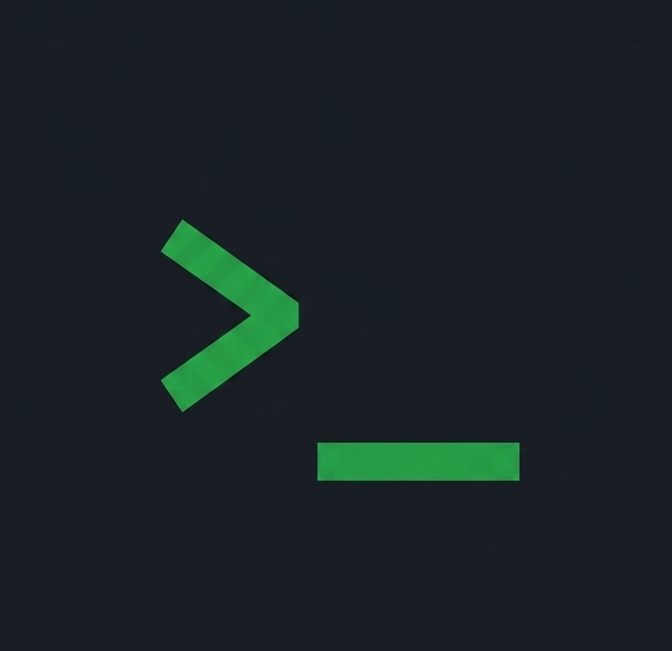

<div align="center">



# Vylop

<p><strong>A real-time collaborative code platform for technical interviews, pair programming, and remote developer teams.</strong></p>

[](#requirements)
[](#tech-stack)
[](#tech-stack)
[](#tech-stack)
[](#features)

</div>

---

## Requirements

Before running Vylop locally, make sure the following software is installed:

| Requirement                    | Version                    |
| ------------------------------ | -------------------------- |
| **Java Development Kit (JDK)** | 17 or higher               |
| **Node.js**                    | 18 or higher               |
| **npm**                        | 9 or higher                |
| **PostgreSQL**                 | 14 or higher               |
| **Apache Maven**               | 3.9 or higher              |
| **Git**                        | Latest recommended version |
| **Docker & Docker Compose**    | Optional                   |

You will also need:

* A running PostgreSQL instance.
* A PostgreSQL database for Vylop.
* The required application configuration values.
* Authentication configuration if using Google OAuth2.

> [!IMPORTANT]
> Never commit database passwords, JWT secrets, OAuth credentials, API keys, or other sensitive configuration values to the repository.

---

## Getting Started

Follow the steps below to run Vylop locally.

### 1. Clone the Repository

Clone the repository and move into the project directory:

```bash
git clone https://github.com/your-username/vylop.git
cd vylop
```

### 2. Set Up PostgreSQL

Create a PostgreSQL database for Vylop:

```sql
CREATE DATABASE vylop_db;
```

Make sure PostgreSQL is running before starting the server.

### 3. Configure the Server

Navigate to the server:

```bash
cd server
```

Configure the database connection and application secrets through your Spring Boot configuration.

For example:

```properties
spring.datasource.url=jdbc:postgresql://localhost:5432/vylop_db
spring.datasource.username=your_postgres_user
spring.datasource.password=your_postgres_password

jwt.secret=your_jwt_secret_key_here
```

Environment variables can also be used where supported by the application configuration.

> [!WARNING]
> The values above are examples only. Replace them with your local configuration and keep secrets outside version control.

### 4. Build the Server

Build the Spring Boot application:

```bash
mvn clean package -DskipTests
```

### 5. Start the Server

Run the application:

```bash
mvn spring-boot:run
```

The server will start at:

```text
http://localhost:8080
```

### 6. Start the Web

Open a **new terminal** and navigate to the web:

```bash
cd web
```

Install the required dependencies:

```bash
npm install
```

Start the Vite development server:

```bash
npm run dev
```

The web will be available at:

```text
http://localhost:5173
```

### 7. Verify the Installation

Once both services are running:

1. Open `http://localhost:5173` in your browser.
2. Verify that the server is running on port `8080`.
3. Create or join a collaborative session.
4. Test real-time code editing.
5. Test workspace and session functionality.

> [!TIP]
> Run the web and server in separate terminal sessions so you can easily monitor logs from both services during development.

---

## Features

### Real-Time Collaborative Editing

Vylop provides a synchronized coding environment where multiple participants can work on the same codebase simultaneously.

* CRDT-based synchronization using **Yjs**
* Conflict-free concurrent editing
* Live remote cursor tracking
* Persistent WebSocket communication
* Monaco Editor integration
* Real-time state synchronization

### Multi-File Workspace Management

Vylop supports complete project workspaces rather than limiting sessions to a single source file.

* Hierarchical file and folder structure
* Empty file creation
* Bulk local file uploads
* Automatic file-extension validation
* Synchronized file deletion
* Persistent workspace state

### Multi-Language Code Execution

Run code directly from the collaborative workspace.

Supported languages include:

* **Java**
* **Python**
* **C++**
* **JavaScript**
* **TypeScript**
* **Go**
* **Rust**

### One-Click Workspace Export

Download the complete multi-file workspace as a `.zip` archive.

This makes it possible to:

* Preserve a coding session locally
* Share the project with other developers
* Continue development outside Vylop

### Live Markdown Preview

Vylop includes a Markdown editing experience with a real-time rendered preview.

This allows users to write documentation alongside their code without leaving the collaborative workspace.

### Integrated Session Chat

Communicate with other participants directly inside a coding session.

Features include:

* Session-based messaging
* User presence
* Typing indicators
* Real-time message delivery

### Cloud Workspace Persistence

Workspaces can be persisted and restored across sessions.

Vylop also includes background cleanup routines for orphaned workspace data to reduce unnecessary database growth.

### Authentication & Security

Vylop provides authenticated access using:

* JWT-based authentication
* Google OAuth2
* Spring Security
* Protected application resources

### Vim Mode

Developers who prefer Vim-style editing can enable Vim keybindings directly inside the Monaco Editor.

---

## Tech Stack

| Layer                       | Technology          | Purpose                           |
| --------------------------- | ------------------- | --------------------------------- |
| **Web**                | React 18            | User interface                    |
| **Build Tool**              | Vite                | Web development and bundling |
| **Editor**                  | Monaco Editor       | Code editing                      |
| **Collaboration**           | Yjs                 | CRDT-based synchronization        |
| **Editor Binding**          | y-monaco            | Yjs ↔ Monaco integration          |
| **Styling**                 | Tailwind CSS        | UI styling                        |
| **Real-Time Communication** | WebSockets / STOMP  | Real-time messaging               |
| **WebSocket Client**        | SockJS / STOMP.js   | Client-side connection management |
| **Server**                 | Java 17             | Server runtime                   |
| **Framework**               | Spring Boot 3       | REST and application services     |
| **Security**                | Spring Security     | Authentication and authorization  |
| **Authentication**          | JWT / Google OAuth2 | User authentication               |
| **Database**                | PostgreSQL          | Persistent data storage           |
| **Build System**            | Maven               | Server dependency management     |
| **Containerization**        | Docker              | Application containerization      |
| **Deployment**              | Render              | Cloud deployment                  |

---

## Project Structure

```text
vylop/
│
├── server/
│   ├── src/
│   │   ├── main/
│   │   └── test/
│   └── pom.xml
│
├── web/
│   ├── public/
│   ├── src/
│   ├── package.json
│   └── vite.config.*
│
├── render.yaml
└── README.md
```

### Server

The `server` directory contains the Spring Boot application responsible for:

* REST APIs
* Authentication and authorization
* WebSocket communication
* Workspace persistence
* User management
* Database interaction
* Session-related server logic

### Web

The `web` directory contains the React application responsible for:

* User interface
* Monaco Editor integration
* Collaborative editing
* Workspace management
* Real-time session features
* Chat and presence
* Client-side application state

---

## License

This project is currently maintained as an open-source project.

See the repository for the applicable license and project policies.
